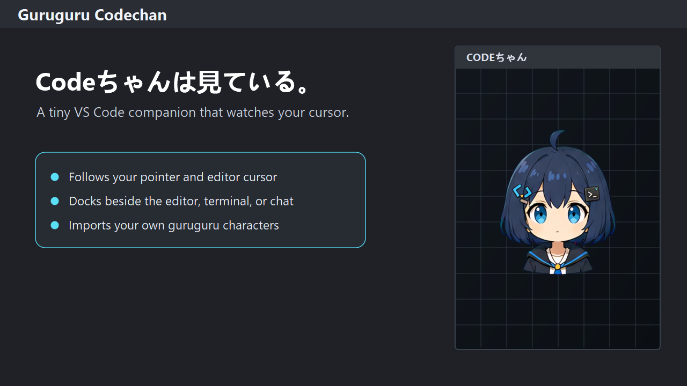
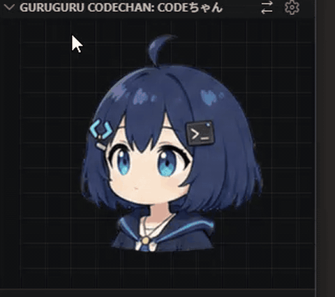
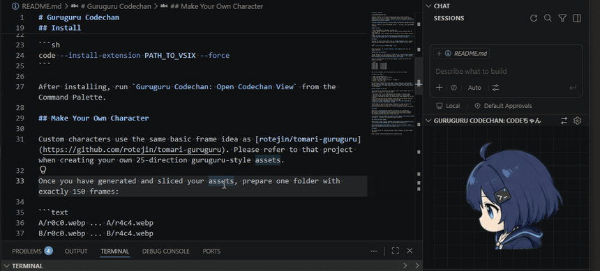

# Guruguru Codechan

**Codeちゃんは見ている。**

Guruguru Codechan is a VS Code extension that adds a dockable Codeちゃん companion view to your workbench.
Codeちゃん blinks, quietly watches your work, and follows the mouse with her gaze when it comes close.

When you get tired, take a short break and play with Codeちゃん.

Of course, you can also replace her with your own guruguru-style character assets.



English | [日本語](./docs/i18n/README.ja.md) | [简体中文](./docs/i18n/README.zh-CN.md)

## Preview

### Mouse interaction



### Editor cursor tracking



## What It Does

- Shows Codeちゃん in a dockable VS Code view.
- Codeちゃん follows the pointer inside the view and the editor cursor when VS Code exposes enough information.
- Lets you adjust position, scale, and gaze lock from settings.
- Lets you import your own 150-frame guruguru-style character assets.

## Install

Install Guruguru Codechan from the [Visual Studio Marketplace](https://marketplace.visualstudio.com/items?itemName=hitsuki-ban.guruguru-codechan), or download the latest VSIX from the [GitHub Releases](https://github.com/Hitsuki-Ban/guruguru-codechan/releases):

```sh
code --install-extension PATH_TO_VSIX --force
```

After installing, run `Guruguru Codechan: Open Codechan View` from the Command Palette.

## Make Your Own Character

Custom characters use the same basic frame idea as [rotejin/tomari-guruguru](https://github.com/rotejin/tomari-guruguru). Please refer to that project when creating your own 25-direction guruguru-style assets.

Once you have generated and sliced your assets, prepare one folder with exactly 150 frames:

```text
A/r0c0.webp ... A/r4c4.webp
B/r0c0.webp ... B/r4c4.webp
C/r0c0.webp ... C/r4c4.webp
D/r0c0.webp ... D/r4c4.webp
E/r0c0.webp ... E/r4c4.webp
F/r0c0.webp ... F/r4c4.webp
```

PNG is also accepted, but one character must use only one format.

To import the folder:

1. Open the Codeちゃん view.
2. Open settings from the view title.
3. Click the import button.
4. Select the folder that contains `A` through `F`.
5. Enter a character name.

The extension validates the frame names and rejects missing frames or mixed formats.
Frames larger than 512px are resized to 512px on their longest edge before they are saved.

Your original asset folder is not changed.

## What Changed For VS Code

This extension follows the browser avatar idea, then adjusts it for everyday use inside VS Code:

- Performance: the runtime shows only the active frame, and imported large images are normalized to 512px to reduce resource use.
- Input: gaze tracking uses pointer and editor-selection information available through the public VS Code API.
- Mouth animation: mouth frames currently react to keyboard input, and the `mouthLevel` channel can be connected to TTS later.

VS Code does not expose global mouse coordinates or exact positions for every workbench panel.
Because of that, Codeちゃん cannot perform perfectly accurate global mouse tracking.

### Troubleshooting

#### Codeちゃん is not looking the right way in the editor

Move the pointer through the Codeちゃん view once, then return to the editor.
Codeちゃん estimates the editor direction from the last direction where the mouse left the view.

#### I want Codeちゃん to look in one fixed direction

Click the settings button, click an empty spot in the companion canvas, then choose `Lock Gaze`.

#### I found another issue

Please report reproducible problems through [GitHub Issues](https://github.com/Hitsuki-Ban/guruguru-codechan/issues).

## Credits And License

Thank you to [rotejin](https://github.com/rotejin) for creating and publishing [tomari-guruguru](https://github.com/rotejin/tomari-guruguru).
That project demonstrated the 25-direction guruguru avatar method and the mouth/blink frame structure.

This project does not include Tomari-related assets.

Program code is MIT licensed.
The bundled sample asset, Codeちゃん, is a fan character designed by Hitsuki.
Codeちゃん is non-commercial only; see [extension/ASSET_LICENSE.md](./extension/ASSET_LICENSE.md).

User-imported assets remain owned by the user or their licensors, and are stored locally.
Please import only assets that you have the right to use.
