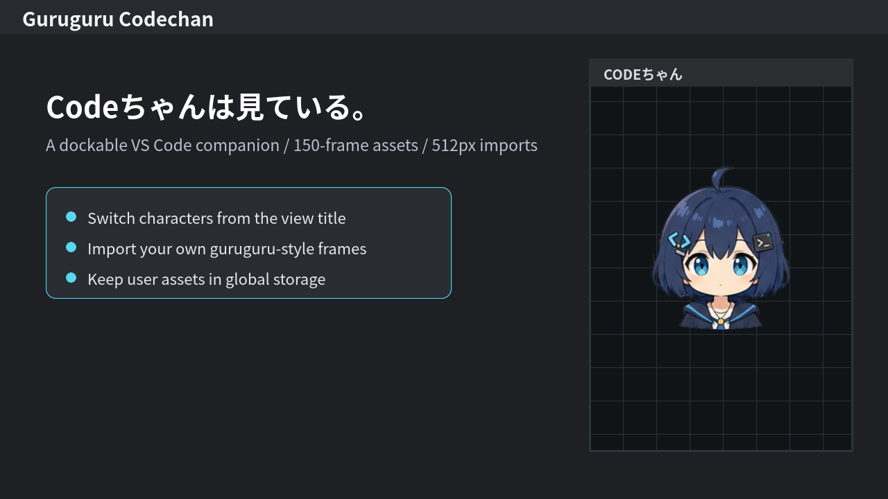

# Guruguru Codechan

**Codeちゃんは見ている。**

Guruguru Codechan is a VS Code extension that adds a small dockable companion view to your workbench. Codeちゃん watches your editor, blinks, turns toward the pointer or editor cursor, and can be replaced with your own guruguru-style character assets.



English | [日本語](./docs/i18n/README.ja.md) | [简体中文](./docs/i18n/README.zh-CN.md)

## What It Does

- Shows Codeちゃん in a dockable VS Code view.
- Tracks pointer movement in the view and editor-cursor movement where VS Code exposes it.
- Lets you move, scale, and gaze-lock the character from a compact settings layer.
- Lets you import your own 150-frame guruguru-style character assets.
- Keeps imported assets local in VS Code global extension storage.

## Install

Download the latest preview VSIX from the [GitHub Releases](https://github.com/Hitsuki-Ban/guruguru-codechan/releases), then install it in VS Code:

```sh
code --install-extension PATH_TO_VSIX --force
```

After installing, run `Guruguru Codechan: Open Codechan View` from the Command Palette.

## Make Your Own Character

Custom characters use the same basic frame idea as [rotejin/tomari-guruguru](https://github.com/rotejin/tomari-guruguru). Please refer to that project when creating your own 25-direction guruguru-style assets.

Once you have generated and sliced your assets, prepare one folder with exactly 150 frames:

```text
A/r0c0.webp ... A/r4c4.webp
B/r0c0.webp ... B/r4c4.webp
C/r0c0.webp ... C/r4c4.webp
D/r0c0.webp ... D/r4c4.webp
E/r0c0.webp ... E/r4c4.webp
F/r0c0.webp ... F/r4c4.webp
```

PNG is also accepted, but one character must use only one format.

To import the folder:

1. Open the Codeちゃん view.
2. Open settings from the view title.
3. Click the import button.
4. Select the folder that contains `A` through `F`.
5. Enter a character name.

The extension validates the frame names, rejects missing or mixed-format assets, resizes frames larger than 512px on their longest edge, and stores the imported copy in VS Code global extension storage. Your original folder is not changed.

## What Changed For VS Code

This extension is inspired by the original browser avatar method, but it is adapted for everyday use inside VS Code:

- The avatar runs in a VS Code Webview view instead of a browser page.
- The view can be docked beside the editor, terminal, or other panels.
- Character switching and import are handled by VS Code commands and in-view settings.
- Gaze tracking uses pointer movement inside the view and editor selection information available through the public VS Code API.
- Rendering is kept lightweight by showing only the active frame and by normalizing imported large assets to 512px.

VS Code does not provide global mouse coordinates or exact positions for every workbench panel, so this extension does not behave like an operating-system-level desktop pet. It stays inside the VS Code view system.

## Credits

Thank you to [rotejin](https://github.com/rotejin) for creating and publishing [tomari-guruguru](https://github.com/rotejin/tomari-guruguru), the original implementation that demonstrated the 25-direction guruguru avatar method and the mouth/blink frame structure.

This project does not bundle the original Tomari assets. The bundled Codeちゃん sample is a separate non-commercial sample asset set.

## License And Asset Rights

Program code is MIT licensed. Bundled sample assets are non-commercial only; see [extension/ASSET_LICENSE.md](./extension/ASSET_LICENSE.md).

User-imported assets remain owned by the user or their licensors. Please import only assets that you have the right to use.

## Support

Use GitHub Issues for reproducible bugs, import problems, and asset-rights questions:

https://github.com/Hitsuki-Ban/guruguru-codechan/issues
